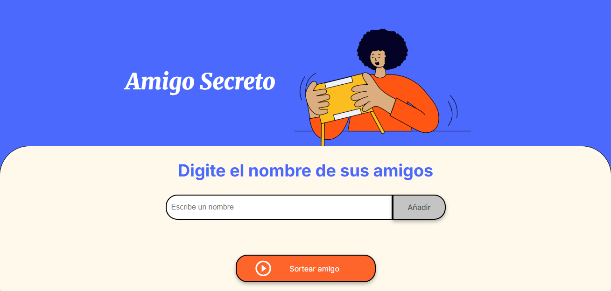

# 🎁 Juego del Amigo Secreto

Una aplicación web simple que permite registrar nombres de amigos y/o participantes y seleccionar al azar un nombre. Ideal para juego del amigo secreto, sorteos, fiestas, reuniones u otros.

## ⚙️ Funcionalidades

- Permite digitar y añadir nombres de amigos o participante a una lista.
- Los nombres se almacenan de forma dinámica en HTML.
- No permite guardar nombres vacios.
- No permite el ingreso de nombres iguales, así esten escritos en su totalidad o parcialmente en minúsculas y/o mayúsculas.
- Al hacer clic en el botón "Sortear amigo", el sistema elige aleatoriamente un nombre de la lista.
- Interfaz sencilla, amigable y colorida para todos los públicos.

## 🛠️ Tecnologías utilizadas

- **HTML5** – Estructura básica de la página.
- **JavaScript** – Lógica para manejar la lista y el sorteo aleatorio.
- **CSS3** – Estilos para dar diseño atractivo.

## 🖥️ ¿Cómo usar?

1. Escribe el nombre de un amigo en el campo de texto.
2. Haz clic en **"Añadir"** para agregarlo a la lista.
3. Una vez agregados todos los nombres, haz clic en **"Sortear amigo"**.
4. El sistema seleccionará aleatoriamente un nombre de la lista y lo mostrara en la caja html.

## 📁 Estructura del proyecto

juego-amigo-secreto:

- **index.html** - Estructura principal de la aplicación.
- **style.css** - Estilos de la interfaz.
- **app.js** - Lógica en JavaScript.
- **assets/** - Imágenes y recursos.
- **README.md** - Documentación del proyecto.

## ✨ Autor

Marvyn Verde en colaboración con Alura Latam.
- https://github.com/marvynverdeallauca/
